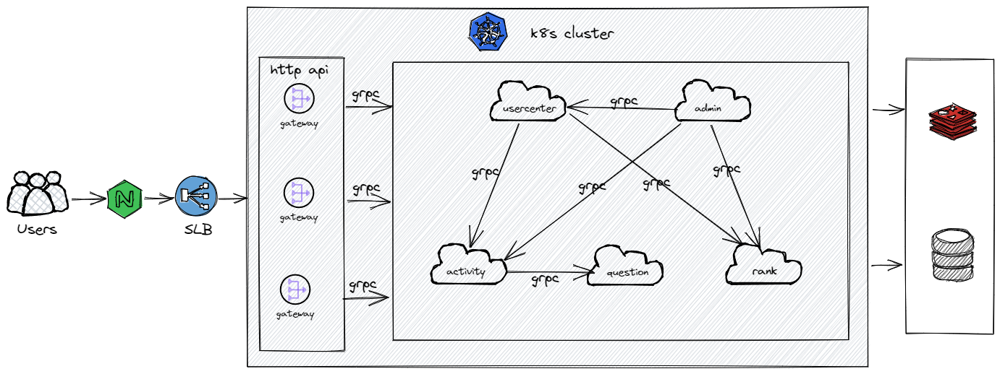

### mandarin-mini-v2

1整个项目使用了go-zero开发的微服务，基本包含了go-zero以及相关的一些中间件，
所用到的技术栈基本是go-zero组件。


项目开发环境推荐docker-compose，使用直链方式，放弃服务注册发现中间件（etcd、nacos、consul等）带来的麻烦

测试、线上部署使用k8s（也不需要etcd、nacos、consul等）


### 更新记录

|     日期     |      功能模块      |   更新人   |
|:----------:|:--------------:|:-------:|
| 2022/10/28 |      重构v2      | leveeer |
| 2022/11/01 | 存储层sqlx组件为gorm | leveeer |
| 2022/11/02 |  新增doc目录下开发文档  | leveeer |


### 项目架构


### 目录结构

```
.
|-- README.md
|-- app                       //服务启动入口
|-- cmd                       //gorm代码生成工具
|   `-- gen
|       |-- generator.go
|       `-- method.go         //自定义的gorm方法
|-- core
|   |-- auth                    //授权相关
|   |-- cachex                  //缓存相关
|   |-- captcha                 //验证码相关
|   |-- casbinx                 //RBAC权限
|   |-- ctxdata                 //上下文数据
|   |-- encodingx               //编解码
|   |-- errx                    //错误码
|   |-- global                  //全局变量、常量
|   |   |-- constKey.go
|   |   `-- redisCacheKey.go
|   |-- interceptor             //拦截器
|   |-- ormx                    //orm相关
|   |-- page                    //分页
|   |-- redisx                  //redis
|   |-- result                  //http返回封装
|   `-- sms                     //短信
|-- dal
|   |-- model                   //grom-gen生成的数据模型
|   `-- query                   //gorm-gen生成的安全的crud方法
|-- deploy                      //项目部署脚本和配置文件
|   |-- etc
|   |   `-- dev
|   |-- rbac
|   |   `-- conf
|   |       `-- rbac_model.conf
|   |-- script
|   |   `-- gencode
|   |       `-- gen.sh
|   `-- sql
|-- doc                         //文档
|-- docker-compose.yml          //容器编排配置文件
|-- service                     //服务实现
|   |-- gateway
|   `-- usercenter
`-- tree.text
```


### 代码规范
尽量遵循: [Uber Go 语言编码规范](https://github.com/leveeer/uber-go-guide)


