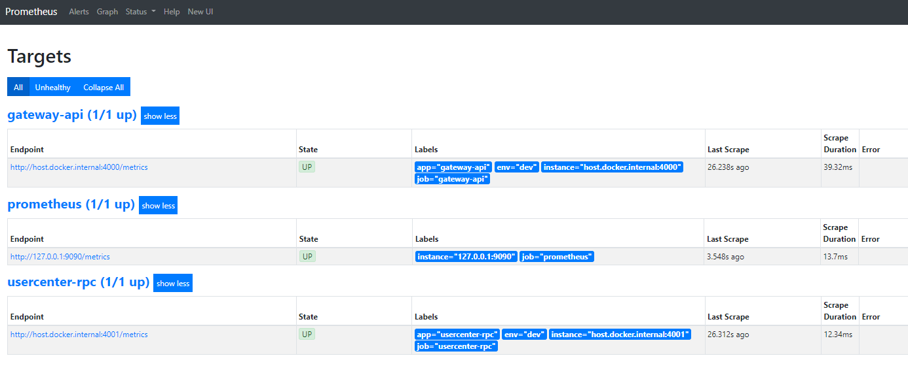

### 项目开发环境搭建

#####   

项目在本地开发时建议采用docker-compose, windows需安装docker desktop, linux直接安装docker和docker-compose即可,

1. 一键部署所有服务，简化部署流程； 
2. modd热加载功能：即时修改代码及时生效，不需要每次都重启， 改了代码自动就在容器中重新加载了，本地不需要启动服务，本地安装的go sdk就是写代码自动提示使用的，
实际运行是以来容器中 lyumikael/go-modd-env:v1.0.0的golang环境。所以使用goland、vscode都一样

#### 1、启动项目所依赖的环境

```shell
$ docker-compose -f docker-compose-env.yml up -d
```

#### 2、启动项目

本地开发使用用docker+热加载，即改即生效

所有服务统一使用modd + golang

直接docker-compose去启动可以

【注】后续如果app下新增业务，要记得在项目根目录下的modd.conf复制添加一份就可以了

```shell
$ docker-compose up -d 
```

【注】依赖的是项目根目录下的docker-compose.yml配置

#### 3、查看项目运行情况

访问 http://127.0.0.1:9090/ ， 点击上面菜单“Status”，在点击Targets ,蓝色的就是启动成了，红色就是没启动成功



【注】如果碰到项目启动不起来的情况， 看看日志查找原因

```shell
$ docker-compose logs -f --tail=100  #--tail参数 表示显示的日志行数
```

#### 4、访问项目

由于没有使用nginx网关，直接在docker-compose镜像配置中把gateway-api的服务端口8080暴露给客户端，所以通过8080端口访问

```shell
$ curl  -X GET "http://127.0.0.1:8080/v1/sys/captcha"

返回:
{"code":200,"msg":"OK","data":{"uuid":"czdv1F1vbCfnK0Q2TMjq","img":"data:image/png;base64,iVBORw0KGgoAAAANSUhEUgAAAPAAAABQCAMAAAAQlwhOAAAA81BMVEUAAABrLmm9gLusb6rPks23erVoK2ZBBD9VGFNDBkHPks1SFVC1eLOSVZCydbBtMGtMD0qWWZSGSYSnaqWeYZyhZJ/HisV4O3ZxNG+4e7ZDBkHOkcycX5p6PXiPUo2dYJu3erVyNXDPks25fLeWWZRWGVTGicR9QHuGSYRtMGtEB0JjJmGjZqF6PXhdIFtiJWCmaaR0N3KnaqXJjMdDBkHHisVgI15OEUzChcCRVI9mKWSbXpm0d7KIS4alaKOTVpG1eLNHCkVIC0a2ebS8f7pfIl27frmBRH9RFE/Mj8qLTomTVpG0d7LHisWlaKO3erVuMWxvL0lCAAAAAXRSTlMAQObYZgAABolJREFUeJzcm91OIzsMgGNxAKGCKHTZC1agXlBACPEjoQpRKm5YBAXe/3WO5ieJ7TiZZCYts7WODp1pYvuLE8eZ7Si/TALfRcpmdxWrk8mkM/Hm5r9F3F3F5mEOR/4hOTxcB+LnhLbL5IWUxnvt7Tw/pxAvTwASiPf2uhC375pVVhXh7gINvp7kNniXW2G8FKxQSID55CQz8d3dKonJSgMNW/3lMq/+9C7CH9EtAacWTWuEt57P54KOXx08LeS8Y3+lPj4iiTUgvWEC7CKLvL+6EZ+ftyF+wRdXcbwGrVyuKKz6f/K0diSO16+pFe8LIr66uoqwr+rZW5KpmYm3dVDTt/BHtqaUWmRQVgqNcIwLgJFns5mTmU3iIsifLZyzlhaLbMSJLtjgVmtYR5i1qaeivf/5aYnl+oYT4XHNGOFUMSvXTF13I9LXngjLFSyLocn7fDhDviWyRChEsxe54uYofSU72xxhlBYbM+Ab6jbPy+zg1ldOdeUksWRD8RF+e7PE83lOYoRVrSvjiRtge2OEyFMsVda0oVDrN9RvnnVeYy5AA+CWz7blaDQCFKw4O/R8mDRDAM4DzV+i9ShFAO3S9bhkozIyXkcec3k7vYb/xHlZll8eO6To8JrHpsktGuHi4wD7SNXY/aXRojN4Fe+fWOKAoUZe3NOE09wjEQZQg8GgvlSOyehy0/W2vozklXXE9qO5ltzDM68OMQwsLd2X43mFee/pZmobz5dtkNFA1YNGDoT4W2DnYTfreIhZJpN2ON4DZUEvlncoAkKDAmyHcCNMoSmCPkrJ3pMbDq4PqQEreV7TUx6N8MQNo4KFJXaPyu4cUWauh33AXQBJIMJHWntSkEGMcMU7mbgLdbFY4Ooa6VFwoYQ5ImayU9cHM1ThgO1b3qMja7r6tBPHSzJy8d9W/eVEqoAGdkWykbq4uMARRir5Ej49NcSsmC76vgcy3/4+IlZISdF+ZyeGGK/i6sPW1pZmcNOJ3pQocKXiQuE8X4MDBCKMimkj7+/vkqNnNbGXIjrC1PHiYkvZRCJGWCF/TbchBsVDGdirnONSGWGR9+zMTzFMSFxo+bBTf+15qDZGdDAcDtk9huw1z8LssRXiLUyH8yLltX/YmGuCAK4tO4dWJcER1jA1jxdBpNtMhpQmICj7AKkgEYpfBZjEyikJkTdyprd7UGkjEV1RtlK8vLBXzXs+3a35LqeEskxvD+yRmFudJ0nzDEE7KiqulFtcS33JhMaQGF57cS+saOC4vsI0RRqGjGxIUkN/iNEGbhtN5S5wf38PYDdo8OXCLMQBZFIdiw4IRyLsm535pUyn03pWTBnGPRqZQOUcqKqjRaxFcX6yaLzr1BkGm3fJ3DReTo+VGoOCipxwGDkKOdtpDVt7HBlnZIWWMTVWeO0EHvDBDaf2kvn4+Hg8HgMAj7BVY2pg0dPOM1orYukHRRhPUUWz+9SdYXZjZUV4raqMsPs4Qz/0UsEIt92HZV2ozjW3wMmudFikoy2NMHHVt3kDjEajKCez8eKzgHUOpCJBsUpJ0CQ98bBKhQICYNQIEv8AMF7cjOsAl21uTOuAeXdtKzuO/IlOTM0X/YhXFs9KofkGbSzo4HBzc9NyvPHcoV8ETiDK1GpdtiSbC4ceG9gRckRT6qb9eIO7MMIhtkczjTtONlqK4R0KxNQcOSLh40Cb8Qa6mq0df4jp4I7HLYm1hHiV4ukLTG5rPb0E5OAi5nOpI68s78Qc4pMmJJa4ny3uAt2nmmt6ejmLspIg+LkRG/1waON+mLq7u8seYKRtsLNZfmL0uflfAZBERlgpxX6ul5Tys/OGJMN5pdaDi8+sNVTP5FV/AH0CVmtN/PpaExcB3tZ315eXRHh72xLX55fM1XKfpIww3Ym7Vcv9F7CnZ1u+r3mIyZNKfiB15GCV7i1BQA6xVw4OekD8u0tn5zcDDe37wPu7E7HS1Pl/Etoot+26debNJMnvEdzetiReijymdmh+c8JZDj/J+8WuHx/Tie1H8Rf9P53wyIP4ry+HuINqzzsbP8xb/VPLRn3JebtJzDsbK5eKd2NjmTb+W6bydrJc3v8aiN+iVV02tgivwddoS53E4aUvoOG3BsJyedlEHM6y5kS8YuGvGK5dhB2Jf4m03/L90w6sWL6/e078t/rzkE1h33n/lsQPD22Ir/P7Y+RpWYo7RPj6ennET0+pxNLr37mlTxGWX/BfZ+kJ7/8BAAD//1pFRy0rHnNeAAAAAElFTkSuQmCC","captchaLength":6}}
```


